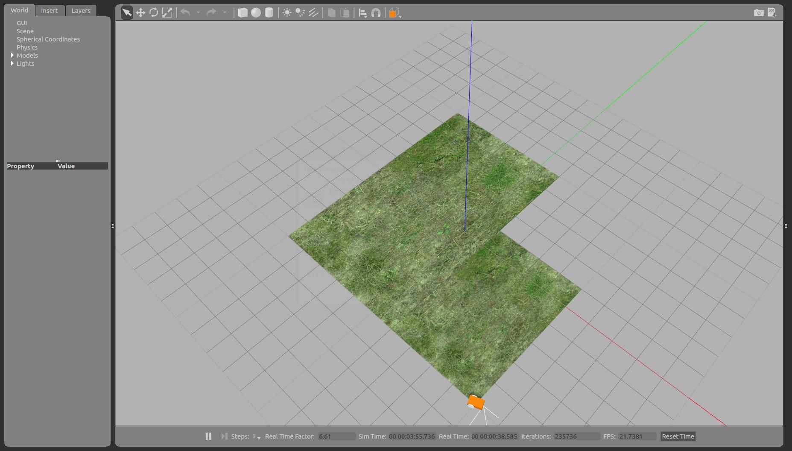
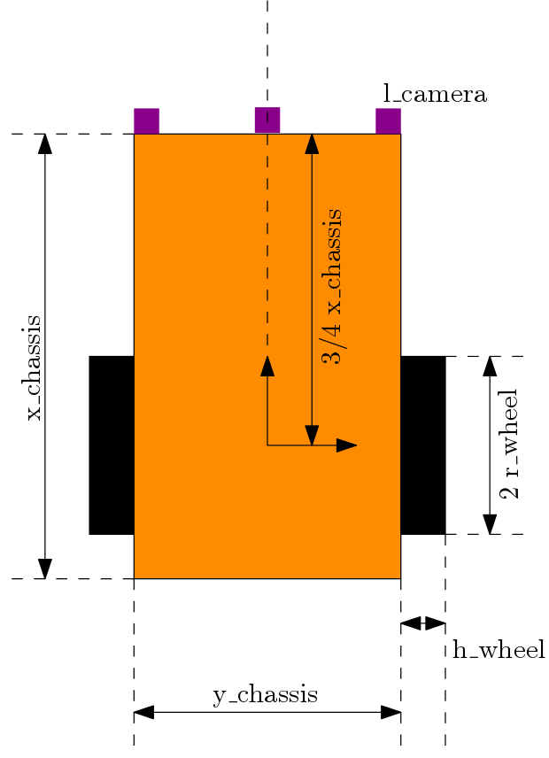

# Autonomous Lawn Mower - ROS
ROS Stack for the self-designed autonomous lawn mower of the University of Luebeck. We aim to design a fully autonomous lawn mower equipped with chlorophyll sensors developed at our Institute. We show that intelligent behavior with only limited sensing is possible.

## Requirements
* ROS Kinetic
* Gazebo V7.0 (comes with the full-Desktop Version of ROS Kinetic)
* Eigen3

## Packages
* simulation_environment: Simulation Environment Package based on Gazebo for testing purposes
* interfaces: Package for interfaces between ROS and the sensors and actuators of the real robot, e.g. the chlorophyll sensors, the IMU, the motor
* localization: Package with localization algorithm such as a particle or a kalman filter
* mapping: Package for the mapping algorithm, where based on a wall following controller a pose graph is generated which is updated due to detected loop closures
* control: Control Package with different control algorithm, such as a PID Controller or a Wall Follower 

## How to get started
- Start by creating a catkin workspace folder and downloading the git repository

  ```bash
  mkdir -p ~/mower_ws/src
  cd ~/mower_ws/src
  git clone https://github.com/NRottmann/AutonomousLawnMowerROS
  ```

- Compile the catkin workspace

  ```bash
  cd ~/mower_ws
  catkin_make
  ```

- Run the mapping algorithm by first sourcing your packages and then starting the launch script

  ```bash
  source devel/setup.bash
  roslaunch mapping mapping_simulation.launch
  ```

- It should open then a Gazebo environment which shows the robot cycling along the boundary of the closed environment, similar to the picture below

  


## Setup of the simulated Lawn Mower

The lawn mower robot properties are defined in the .yaml-file

```bash
AutonomousLawnMowerROS/simulation_environment/config/props.yaml
```

The properties define the structure of the robot as defined in the Figure below.



